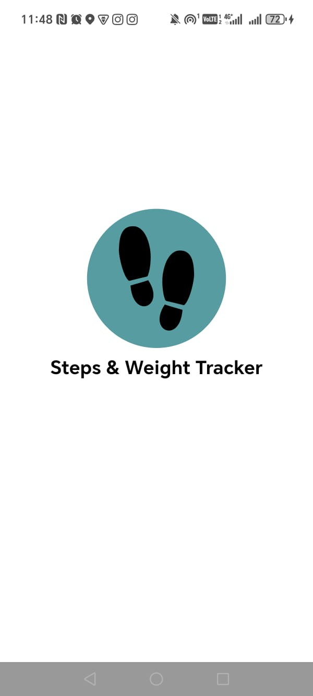
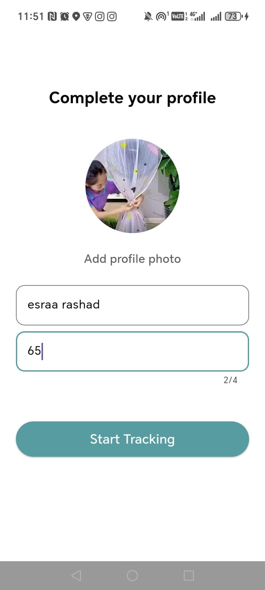
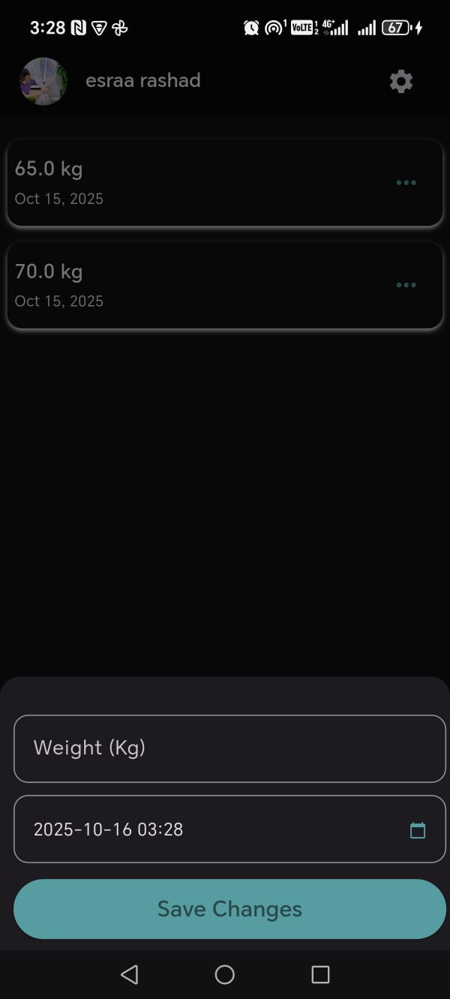
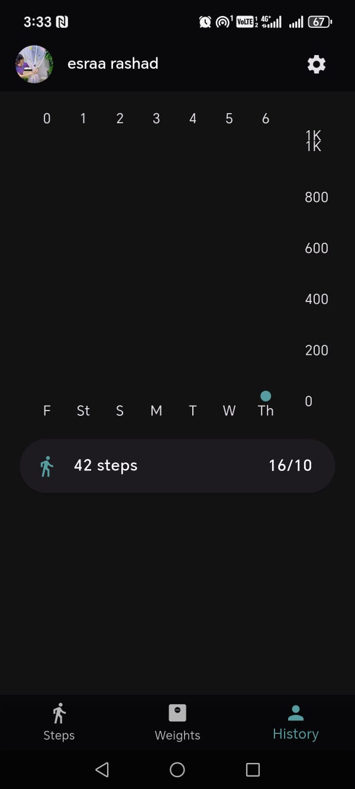
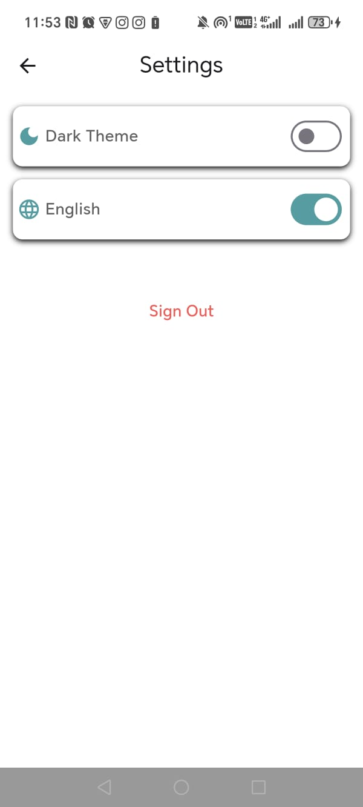

# 🏃‍♀️ Steps Tracker App

A modern Flutter application that helps users track their daily and weekly steps using real-time pedometer data.  
Built with a clean UI, Firebase integration, and multi-language support.

---

## 📱 Features
- 🔹 Real-time step counting using the pedometer package
- 🔹 Daily and weekly progress tracking with charts
- 🔹 Firebase authentication and Firestore d
- 🔹 Automatic step tracking in the background
- 🔹 Localization (English / Arabic support)
- 🔹 Clean, responsive UI with light & dark modes

---

## 🖼️ Screenshots

### Splash



### Setup Profile


### Home Screen


### weight screen 


### steps history



### Setting



> 📌 Place your screenshots in the `screenshots/` folder inside your project directory.

---

## 🧩 Tech Stack
- **Framework:** Flutter
- **State Management:** Bloc / Cubit (or Riverpod — adjust if needed)
- **Backend:** Firebase (Auth, Firestore, Storage)
- **Packages Used:**
    - `pedometer`
    - `firebase_core`
    - `firebase_auth`
    - `cloud_firestore`
    - `shared_preferences`
    - `fl_chart`
    - `intl`

---

## ⚙️ Installation & Setup

### 1️⃣ Clone the repository
```bash
https://github.com/esraarashad19/Steps_Tracker_task.git


